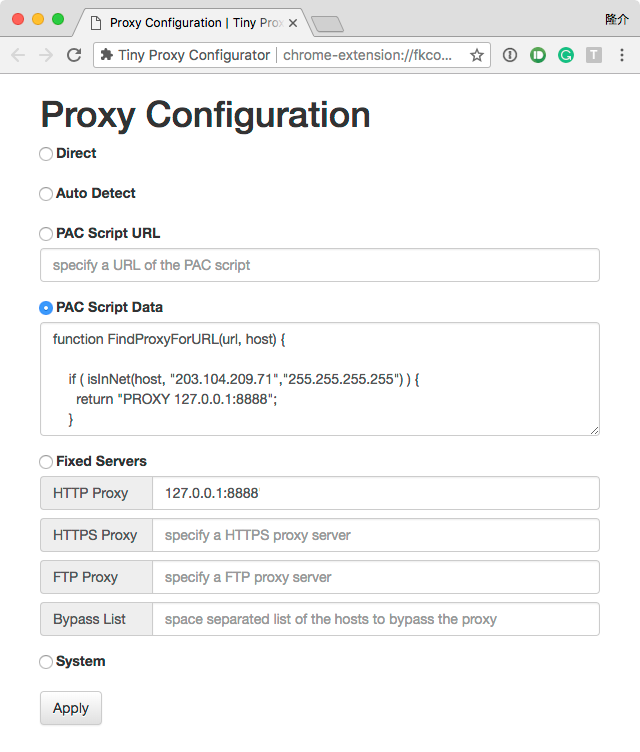

# Tiny Proxy Configurator
A tiny and simple proxy configurator for Google Chrome.

This extension is available in [Chrome Web Stor](https://chrome.google.com/webstore/detail/tiny-proxy-configurator/ilgignoiaacgbcagkcmfmbgnjbemedam).



## How to set up a proxy

TBD

### Proxy Server

see also:  [chrome.proxy#type-ProxyServer](https://developer.chrome.com/extensions/proxy#type-ProxyServer)

#### Syntax

```
<syntax> ::= [ <scheme> "://" ] <host> [ ":" <port> ]
<scheme> ::= "http" | "https" | "quic" | "socks4" | "socks5"
<host> ::= <hostname> | <ipv4-address> | "[" <ipv6-address> "]"
```

#### Examples

```
127.0.0.1
127.0.0.1:8080
https://127.0.0.1
quic://[::1]:8080
```

### Bypass List

see also: [chrome.proxy#bypass_list](https://developer.chrome.com/extensions/proxy#bypass_list)

#### Syntax

```
<syntax> ::= <patterns>
<patterns> ::= <pattern> | <pattern> <whitespace> <patterns>
<pattern> ::= [ <scheme> "://" ] <host-pattern> [ ":" <port> ]
```

#### Examples

```
foobar.com *foobar.com *.foobar.com *foobar.com:99 https://x.*.y.com:99
```

## About icon


串 (Kushi, /kɯʃi/) is a Japanese internet slang which means proxy.

## License

[MIT License](LICENSE)

Copyright (c) 2018-2022 Ryusuke SEKIYAMA

## Credits

This software contains icons provided by [Font Awesome](https://fontawesome.com/) licensed as [CC BY 4.0](https://fontawesome.com/license).
